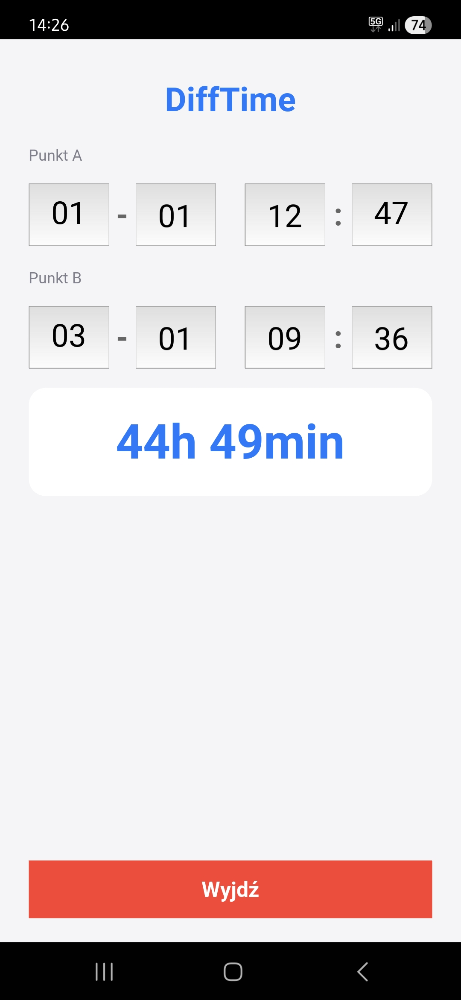

## DiffTime

Różnica pomiędzy dwoma punktami w czasie

DiffTime to prosta aplikacja na Androida służąca do obliczania dokładnej różnicy czasu pomiędzy dwoma momentami.

Aplikacja:

- poprawnie uwzględnia lata przestępne

- działa wyłącznie w trakcie uruchomienia (nie zapisuje żadnych danych na urządzeniu)

- przyjmuje daty w dowolnej kolejności (wcześniejsza → późniejsza lub odwrotnie)

- zwraca wynik w pełnych godzinach i minutach

---

## Zastosowanie

Aplikacja powstała z myślą o własnych potrzebach — do precyzyjnego wyliczania czasu przerwy podczas pracy jako kierowca zawodowy.

Może być jednak używana wszędzie tam, gdzie potrzebne jest dokładne obliczenie różnicy czasu wyrażonej w godzinach i minutach.

---

## Zrzut ekranu

---

## Licencja MIT
Copyright (c) 2026 CodeTruckerDev (Piotr M.)

Projekt jest udostępniony na licencji MIT — szczegóły znajdują się w pliku [LICENSE](LICENSE).

Podanie źródła nie jest wymagane, ale będzie mile widziane.
Jeśli wykorzystasz ten kod, link do oryginalnego repozytorium pomoże innym odnaleźć źródło projektu i wesprze niezależnych twórców.

---

> "Nie jestem programistą z zawodu. Jestem nim z powołania."
